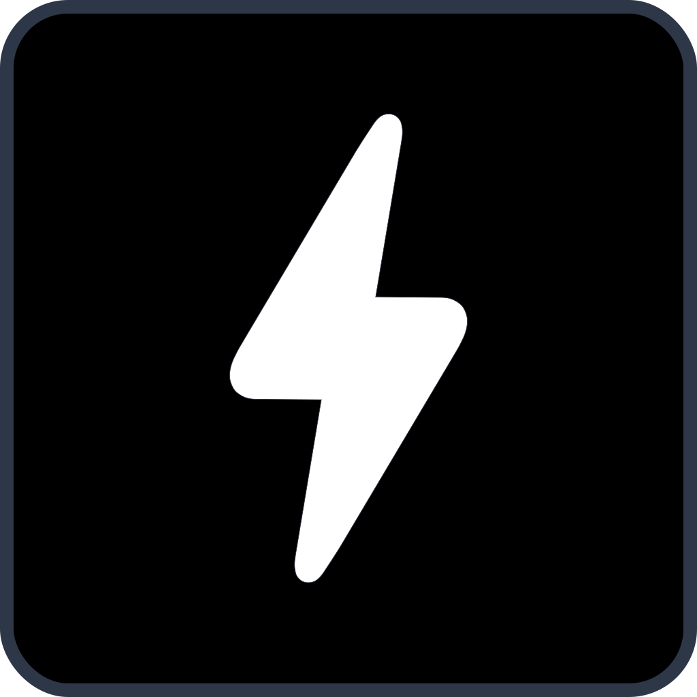

<!-- markdownlint-disable MD033 MD041 -->
<p align="center">
  
  <h1 align="center">Voltaserve for macOS</h1>
</p>

<h3 align="center">Reality OS for Creators</h2>

<p align="center">
  <a href="https://apps.apple.com/mac/app/id6744360805">
    
  </a>
</p>

<p align="center">
  <a href="https://youtu.be/sCfvdj49WBw">▶ Talk to your files and manilulate them</a>
  <br/>
  <a href="https://youtu.be/Uf3EWb2hDfs">▶ Your creative private cloud</a>
</p>

[](https://discord.gg/qYXtsMpqMR)

This is Voltaserve's macOS app, it’s fully native, features a slick user interface with real-time updates, and is built using Apple’s flagship framework, SwiftUI.

## Usage

- Make sure your Voltaserve instance is up and running, or follow the instructions [here](https://github.com/kouprlabs/voltaserve) to create a new instance.
- Install the app on your device with Xcode.
- On the sign in screen, in the upper right corner, click the cog button to create a new server that points to the URLs of your instance, **then activate it**, example URLs:
  - API: `http://localhost:8080`
  - Identity Provider: `http://localhost:8081`
- Sign in and enjoy!

## Getting Started

Prerequisites:

- Install [Xcode](https://developer.apple.com/xcode/).
- Install [SwiftLint](https://github.com/realm/SwiftLint).

Format code:

```shell
swift format -i -r .
```

Lint code:

```shell
swift format lint -r .
```

```shell
swiftlint lint --strict .
```

## Licensing

Voltaserve Mac is released under the [Business Source License 1.1](LICENSE).
